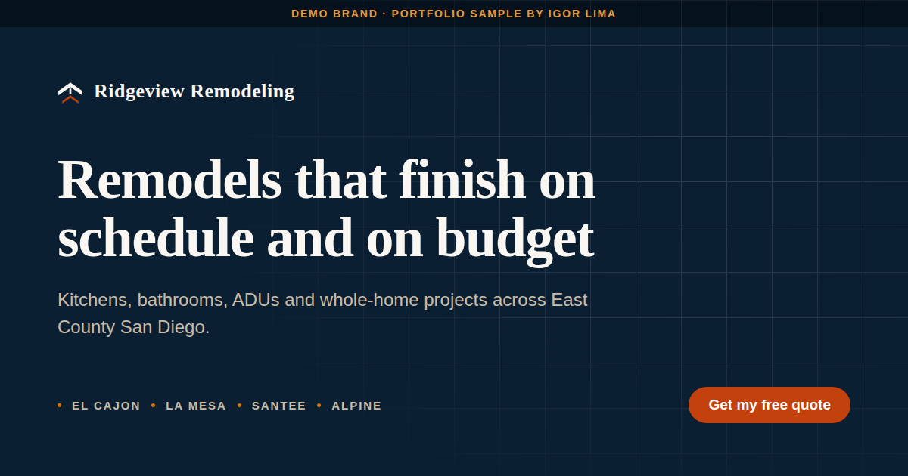

<div align="center">



# Ridgeview Remodeling

**A demo contractor marketing site. Astro + Tailwind on GitHub Pages, with a free lead-alert layer.**

### [Live site](https://igorcsis.github.io/ridgeview-remodeling-demo/)


</div>

> **Ridgeview Remodeling is a fictional company.** It does not exist, has no license, and has never
> built anything. This site is a portfolio sample built by [Igor Lima](https://igorcsis.github.io/niftyai-portfolio/)
> to show what a contractor's website should look like and how the lead flow behind it works.
> Every review on the page is a written sample and is labeled as one.

## What this is for

This is the thing to show a contractor who says *"I don't want automation, I'd just pay for a website."*

The site is good enough to sell as a website on its own. Behind it, a thin free layer proves the
second half of the pitch: the lead does not just land in an inbox and rot. That is the upsell, and
the demo makes it concrete instead of theoretical.

## The stack, and why

| Layer | Choice | Why |
|---|---|---|
| Framework | **Astro 4 + Tailwind 3** | Ships static HTML with almost no JavaScript. A React SPA would ship a client app this page does not need, and Next.js is overkill with pickier free hosting. |
| Host | **GitHub Pages** | Free forever on a public repo, no card, no cold starts. |
| Forms | **Web3Forms** | Free tier around 250 submissions a month, versus roughly 50 on Formspree. Emails the owner directly. No paid webhook needed. |
| Automation | Form → owner email → thank-you page | Zero ongoing cost. No Twilio, because SMS costs money per message. |
| Python tool | `tools/lead_followup_drafter.py` | Deterministic templates, no API key, no network. |
| LLM APIs | **Not required** | The live site works at $0/month forever. Nothing on the page calls a model. |

Total running cost: **$0**.

## Run it locally

Requires Node 18 or newer, built on Node 22.

```bash
pnpm install
cp .env.example .env     # then paste your Web3Forms key
pnpm dev                 # http://localhost:4321/ridgeview-remodeling-demo

pnpm build && pnpm preview
```

## Wiring up the form (about two minutes)

The form works without a key in the sense that it renders, but it cannot send. When no key is
present the page shows a visible "not wired up yet" notice instead of failing silently.

1. Go to [web3forms.com](https://web3forms.com) and enter the email address that should receive leads.
2. Check that inbox, copy the access key.
3. Local: put it in `.env` as `PUBLIC_WEB3FORMS_ACCESS_KEY=...`
4. Production: repo **Settings → Secrets and variables → Actions → New repository secret**, same name.
5. Push, or run the deploy workflow manually. Done.

The key is not a secret in the usual sense. It only allows delivery to the inbox that created it, and
it is visible in the page source of any site using Web3Forms. It is kept out of git so this demo does
not route strangers' submissions into a real inbox.

### What the owner receives

Every field, in a plain email. Field names are the email labels, so the message reads as
`Project type`, `Timeline`, `Budget`, `City or ZIP`, `Project details`, `Name`, `Email`, `Phone`.

## Deploying

Every push to `main` runs `.github/workflows/deploy.yml`, which builds and publishes to Pages.
Before the first deploy, enable it once:

**Settings → Pages → Source: GitHub Actions**

Without that toggle the workflow runs green and nothing goes live.

## The Python tool

```bash
python tools/lead_followup_drafter.py
python tools/lead_followup_drafter.py --only-urgent
python tools/lead_followup_drafter.py --csv path/to/leads.csv
```

Reads a CSV export of leads and prints a ready-to-send SMS and email draft for each, flagging the
ones whose timeline says they need a reply today. Deterministic templates, so the same lead always
produces the same draft. No API key, no network, no cost.

It exists to make the upsell concrete: the website captures the lead, and this is the shape of the
thing that stops the lead going cold while the contractor is up a ladder.

**Style:** this file follows the Appendix A Python conventions strictly. Classes use private
attributes behind `@property`, setters validate, every class defines `__str__`, constants use
`typing.Final`, every module, class and function carries a multi-line docstring with Parameters,
Returns and Raises, and execution is guarded by `if __name__ == '__main__'`.

## White-labeling this for a real contractor

Almost everything is one file: **`src/data/content.ts`**. The components render it.

| What to change | Where |
|---|---|
| Company name, phone, cities, email | `business` |
| Page title and meta description | `meta` |
| Headline, subcopy, CTAs | `hero` |
| Services and their bullets | `services` |
| **Price bands** | `costs` |
| Project captions | `projects` |
| Reviews | `reviews` |
| FAQ | `faq` |
| Form fields and options | `quoteForm` |

Then the things that are **not** just text:

1. **Delete the demo disclosure bar** in `src/components/Nav.astro` and the `demoNotice` block. It
   exists because this brand is fictional.
2. **Replace the price ranges** in `costs` and in the FAQ. The current numbers are plausible East
   County figures for a demo, not any real contractor's pricing.
3. **Replace the sample reviews with real ones**, and remove the `Sample` tag and the disclaimer in
   `src/components/Reviews.astro`.
4. **Add the real license number** to `trustStrip`. The demo says "Licensed & insured (demo)"
   precisely because inventing a CSLB number would be a fabrication that could collide with a real
   licensee's.
5. **Swap the drawn gallery tiles for real project photos.** The tiles in `src/assets/tile-*.svg`
   are original architectural illustrations, used because there are no real jobs to photograph and
   because they carry no stock-image licensing. Real before-and-after photos beat them every time.
6. **Only then**, add `Review` and `AggregateRating` structured data. It is deliberately absent
   today: shipping fabricated review markup is a Google structured-data policy violation, and it is
   the kind of fake a human reader cannot see. See the comment in `src/layouts/Layout.astro`.

## What to charge

Bands, not quotes. Adjust to the market and to how much of the content the client supplies.

| Package | Range | What it is |
|---|---|---|
| **Website only** | $2,000 to $4,000 | This site, white-labeled: their brand, copy, photos, service area. Form emails them. They own it. |
| **Website + lead routing** | $3,500 to $6,000 | The above, plus lead capture into a sheet or CRM, instant owner alert, and the follow-up drafts. |
| **Care plan** | $100 to $250 a month | Hosting oversight, content edits, keeping the lead flow alive, monthly numbers. |

The jump from the first row to the second is the whole reason this demo exists. The website is the
thing they already believe they want. The lead routing is the thing that makes them money, and it is
much easier to sell once they can see it.

## The 60-second demo script

1. **Open the site on your phone and hand them the phone.** Do not narrate. Let them scroll. Most
   contractor sites they have seen look nothing like this, and the contrast does the work.
2. **"Scroll to the money section."** Point out that it names real ranges. *"Every competitor of
   yours hides this. The homeowner leaves to go find a number somewhere else. This one keeps them."*
3. **Fill in the form in front of them.** Takes twenty seconds. Land on the thank-you page.
4. **Point at the checklist on the thank-you page.** *"They are getting three quotes whether you
   like it or not. This page hands them the questions to ask, and the questions are the ones you win
   on. Your competitor cannot answer half of them."*
5. **Now the upsell.** *"The site got you the lead. What I do next is make sure you reply first.
   Here is the drafts tool."* Run `python tools/lead_followup_drafter.py` on a laptop.
6. **Close on speed.** *"The contractor who replies in ten minutes books the job. The one who
   replies tomorrow gets told they went with someone else. That is the whole product."*

## Deliberate decisions worth knowing

- **No photo uploads on the form.** Photos would genuinely improve lead quality, but every free form
  backend charges for attachments, and this demo runs at zero cost. Documented rather than hidden.
- **Single-step form, not multi-step.** A three-step form measurably helps on a ticket this size,
  mostly by hiding the phone field until late. The field *order* already does most of that work, and
  a single step has a stronger no-JS path. Worth revisiting with real traffic.
- **Field order is project-first, phone last.** The homeowner is glad to answer questions about their
  own kitchen and indifferent about handing over a phone number. By the time they reach the field
  they like least, they have answered five things already.
- **The FAQ sits below the form on purpose.** It catches whoever scrolled past with one question left.
- **No stock photography anywhere.** Every mark, icon, tile and backdrop is an original SVG in
  `src/assets/`. No licensing to track, nothing to attribute, and nothing that looks like a template.

## Accessibility and performance

- Every contrast pair on the page was computed with the WCAG relative-luminance formula and clears
  4.5:1 for body text or 3:1 for large text and control boundaries. Two pairings that fail are
  documented in `tailwind.config.mjs` and never used.
- Interactive targets are at least 48px. Focus rings are visible on both the light and dark bands.
- `prefers-reduced-motion` removes every transform and length change, and content still ends visible.
- The FAQ is native `<details>`, and the form posts natively, so the page works with JavaScript off.
- No render-blocking web font, no carousel, no client framework. About 5KB of hand-written JS.

## License

MIT. See [LICENSE](LICENSE). The code is free to reuse. The Ridgeview name and mark are demo
material, so use your own for a real business.
